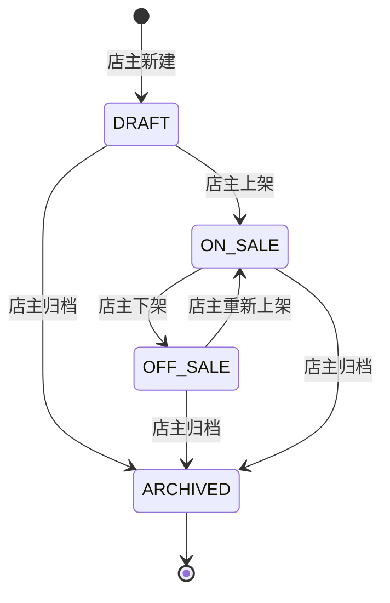

# Stage 3：商品目录闭环规格

## 1. 阶段目标

在 Stage 2 已完成商户入驻的基础上，交付商品目录的最小业务闭环：管理员创建和维护平台统一分类，店主管理本店商品（新增、编辑、上下架、归档、库存调整和图片上传），游客和会员可按分类筛选和中文关键词搜索商品并查看详情。商品价格变更通过数据库触发器自动记录价格历史。

本阶段只实现分类、商品、图片上传和公开浏览，不实现购物车、订单、支付、退款和用户地址管理。

## 2. 成功标准

- 从 Stage 2 数据库继续执行迁移，新增 `categories`、`products` 和 `product_price_history`；
- 管理员可创建、编辑、启用和停用分类，分类名称全平台唯一；
- 店主可新增草稿商品、编辑商品信息、上传商品图片、调整库存、上架、下架和归档；
- 店主不能操作其他店铺商品；
- 商品状态机：DRAFT → ON_SALE ↔ OFF_SALE → ARCHIVED（终态）；
- 公开商品列表仅展示 ON_SALE 状态且所属店铺和分类正常的商品；
- 商品搜索使用 MySQL FULLTEXT ngram 索引支持中文关键词；
- 商品价格变化通过数据库触发器自动写入 `product_price_history`；
- 下架、停用分类和停用店铺的商品不出现在公开列表；
- 非图片和超限上传文件被拒绝。

## 3. 非目标

- 多规格 SKU；
- 购物车、订单、支付和退款；
- 会员地址管理；
- 商品收藏、评价和推荐；
- 优惠券和促销；
- 店铺 Logo 上传；
- 完整管理后台仪表盘。

## 4. 数据库设计

### 4.1 categories

```sql
CREATE TABLE categories (
  id BIGINT UNSIGNED NOT NULL AUTO_INCREMENT,
  name VARCHAR(100) NOT NULL,
  description VARCHAR(500) NULL,
  sort_order INT UNSIGNED NOT NULL DEFAULT 0,
  status VARCHAR(20) NOT NULL DEFAULT 'ACTIVE',
  created_at DATETIME(3) NOT NULL DEFAULT CURRENT_TIMESTAMP(3),
  updated_at DATETIME(3) NOT NULL DEFAULT CURRENT_TIMESTAMP(3) ON UPDATE CURRENT_TIMESTAMP(3),
  PRIMARY KEY (id),
  UNIQUE KEY uq_categories_name (name),
  CONSTRAINT chk_categories_status CHECK (status IN ('ACTIVE', 'DISABLED'))
);
```

### 4.2 products

```sql
CREATE TABLE products (
  id BIGINT UNSIGNED NOT NULL AUTO_INCREMENT,
  shop_id BIGINT UNSIGNED NOT NULL,
  category_id BIGINT UNSIGNED NOT NULL,
  name VARCHAR(200) NOT NULL,
  price DECIMAL(12,2) NOT NULL,
  stock INT UNSIGNED NOT NULL DEFAULT 0,
  description TEXT NOT NULL,
  image_path VARCHAR(255) NOT NULL DEFAULT '',
  status VARCHAR(20) NOT NULL DEFAULT 'DRAFT',
  created_at DATETIME(3) NOT NULL DEFAULT CURRENT_TIMESTAMP(3),
  updated_at DATETIME(3) NOT NULL DEFAULT CURRENT_TIMESTAMP(3) ON UPDATE CURRENT_TIMESTAMP(3),
  PRIMARY KEY (id),
  KEY idx_products_shop_status (shop_id, status, created_at),
  KEY idx_products_category_status (category_id, status, created_at),
  KEY idx_products_status_created (status, created_at),
  FULLTEXT KEY ft_products_name_desc (name, description) WITH PARSER ngram,
  CONSTRAINT fk_products_shop FOREIGN KEY (shop_id) REFERENCES shops (id),
  CONSTRAINT fk_products_category FOREIGN KEY (category_id) REFERENCES categories (id),
  CONSTRAINT chk_products_price_non_negative CHECK (price >= 0),
  CONSTRAINT chk_products_status CHECK (status IN ('DRAFT', 'ON_SALE', 'OFF_SALE', 'ARCHIVED'))
);
```

### 4.3 product_price_history

```sql
CREATE TABLE product_price_history (
  id BIGINT UNSIGNED NOT NULL AUTO_INCREMENT,
  product_id BIGINT UNSIGNED NOT NULL,
  old_price DECIMAL(12,2) NOT NULL,
  new_price DECIMAL(12,2) NOT NULL,
  changed_by BIGINT UNSIGNED NULL,
  changed_at DATETIME(3) NOT NULL DEFAULT CURRENT_TIMESTAMP(3),
  PRIMARY KEY (id),
  KEY idx_product_price_history_product (product_id, changed_at),
  CONSTRAINT fk_product_price_history_product FOREIGN KEY (product_id) REFERENCES products (id),
  CONSTRAINT fk_product_price_history_changed_by FOREIGN KEY (changed_by) REFERENCES users (id)
);
```

价格历史触发器：

```sql
CREATE TRIGGER trg_products_price_history
AFTER UPDATE ON products
FOR EACH ROW
BEGIN
  IF NEW.price <> OLD.price THEN
    INSERT INTO product_price_history (product_id, old_price, new_price, changed_by)
    VALUES (NEW.id, OLD.price, NEW.price, @novamall_actor_user_id);
  END IF;
END;
```

## 5. 商品状态机



状态规则：

- `DRAFT`：草稿，仅店主可见，不出现在公开列表；
- `ON_SALE`：上架，公开可见；
- `OFF_SALE`：下架，仅店主可见；
- `ARCHIVED`：归档终态，不可再编辑或修改状态；
- 只有 DRAFT 和 OFF_SALE 状态可编辑商品信息；
- 上架前必须已上传商品图片。

## 6. API 合同

### 6.1 公开分类接口

| 方法 | 路径 | 角色 | 说明 |
|---|---|---|---|
| GET | `/categories` | 公开 | 查询启用状态的分类列表 |

### 6.2 公开商品接口

| 方法 | 路径 | 角色 | 说明 |
|---|---|---|---|
| GET | `/products` | 公开 | 分页查询上架商品，支持分类筛选、关键词搜索和排序 |
| GET | `/products/:productId` | 公开 | 上架商品详情（含店铺和分类信息） |

`GET /products` 参数：

- `page`：默认 1；
- `pageSize`：默认 20，最大 100；
- `categoryId`：可选，按分类筛选；
- `keyword`：可选，按商品名称和简介全文搜索；
- `sort`：`newest`（默认）、`priceAsc`、`priceDesc`、`relevance`（需有关键词）。

### 6.3 店主商品接口

| 方法 | 路径 | 角色 | 说明 |
|---|---|---|---|
| GET | `/owner/products` | OWNER | 本店商品分页，支持状态筛选 |
| POST | `/owner/products` | OWNER + CSRF | 新增草稿商品 |
| GET | `/owner/products/:productId` | OWNER | 本店商品详情（含完整信息） |
| PATCH | `/owner/products/:productId` | OWNER + CSRF | 编辑商品信息 |
| PATCH | `/owner/products/:productId/stock` | OWNER + CSRF | 调整库存 |
| POST | `/owner/products/:productId/publish` | OWNER + CSRF | 上架商品 |
| POST | `/owner/products/:productId/unpublish` | OWNER + CSRF | 下架商品 |
| POST | `/owner/products/:productId/archive` | OWNER + CSRF | 归档商品 |
| GET | `/owner/products/:productId/price-history` | OWNER | 价格变更历史 |

新增商品请求：

```json
{
  "name": "新鲜草莓500g",
  "price": "29.90",
  "stock": 100,
  "description": "当日采摘新鲜草莓，甜度高，适合直接食用或制作甜品。",
  "categoryId": "1",
  "imagePath": "/uploads/products/strawberry-abc123.jpg"
}
```

库存调整请求：

```json
{
  "stock": 150
}
```

### 6.4 图片上传接口

| 方法 | 路径 | 角色 | 说明 |
|---|---|---|---|
| POST | `/uploads/products` | OWNER + CSRF | 上传商品图片 |

请求格式：`multipart/form-data`，字段名 `image`。
限制：仅允许 PNG、JPEG、WebP，最大 5 MB。

上传响应：

```json
{
  "success": true,
  "data": {
    "path": "/uploads/products/abc123-strawberry.jpg"
  }
}
```

### 6.5 管理员分类接口

| 方法 | 路径 | 角色 | 说明 |
|---|---|---|---|
| GET | `/admin/categories` | ADMIN | 全部分类分页 |
| POST | `/admin/categories` | ADMIN + CSRF | 新增分类 |
| PATCH | `/admin/categories/:id` | ADMIN + CSRF | 编辑分类 |
| POST | `/admin/categories/:id/disable` | ADMIN + CSRF | 停用分类 |
| POST | `/admin/categories/:id/enable` | ADMIN + CSRF | 启用分类 |

新增分类请求：

```json
{
  "name": "新鲜水果",
  "description": "各类时令新鲜水果",
  "sortOrder": 1
}
```

## 7. 新增错误码

| 错误码 | HTTP | 含义 |
|---|---:|---|
| `CATEGORY_NAME_TAKEN` | 409 | 分类名称已被使用 |
| `PRODUCT_NOT_OWNED` | 403 | 商品不属于当前店铺 |
| `PRODUCT_STATUS_CONFLICT` | 409 | 当前商品状态不允许此操作 |
| `UPLOAD_INVALID` | 400 | 上传文件不合法 |

## 8. 后端实现方案

新增模块 `apps/api/src/modules/categories/` 和 `apps/api/src/modules/products/`，沿用 Route → Controller → Service → Repository 模式。

### 8.1 商品公开搜索

使用 MySQL FULLTEXT 搜索：

```sql
SELECT ... FROM products p
JOIN shops s ON s.id = p.shop_id
JOIN categories c ON c.id = p.category_id
WHERE p.status = 'ON_SALE' AND s.status = 'ACTIVE' AND c.status = 'ACTIVE'
  AND MATCH(p.name, p.description) AGAINST(? IN BOOLEAN MODE)
ORDER BY ... LIMIT ? OFFSET ?
```

无关键词时按非 FULLTEXT 排序（newest、priceAsc、priceDesc）。

### 8.2 店主商品操作

所有店主操作通过当前用户查找所属店铺，并以 `p.shop_id = ?` 作为查询条件，确保只能操作本店商品。

### 8.3 价格历史审计上下文

编辑商品价格前设置数据库会话变量：

```sql
SET @novamall_actor_user_id = ?;
```

触发器从会话变量读取操作者，写入 `product_price_history.changed_by`。

## 9. 前端信息架构

### 9.1 公开商品浏览

新增独立路由 `/catalog` 和 `/products/:productId`：

- 商品列表页：左侧/顶部分类筛选，搜索框，商品卡片网格（图片、名称、价格、店铺名）；
- 商品详情页：大图、名称、价格、店铺信息、商品描述、分类标签；
- 未登录用户可正常浏览，点击"加入购物车"引导登录。

### 9.2 管理员分类管理

在管理员工作区增加分类管理区域：

- 分类列表（名称、描述、排序、状态）；
- 新增分类表单；
- 编辑按钮和启用/停用操作。

### 9.3 店主商品管理

在店主工作区增加商品管理区域：

- 商品列表（状态筛选、分页）；
- 新增/编辑商品表单（含图片上传、分类选择）；
- 库存调整；
- 上架/下架/归档操作；
- 价格历史查看。

## 10. 测试策略

### 10.1 API 与数据库集成测试

- 管理员分类 CRUD 和状态切换；
- 店主商品 CRUD、状态流转和库存调整；
- 店主不能操作其他店铺商品；
- 公开列表仅显示 ON_SALE + ACTIVE 分类 + ACTIVE 店铺的商品；
- 中文关键词全文搜索返回相关商品；
- 价格变化生成历史记录；
- 图片上传格式和大小校验。

### 10.2 前端测试

- 商品列表渲染和筛选交互；
- 商品详情展示；
- 分类管理表单和状态操作；
- 商品管理表单、图片上传和状态流转；
- 未登录用户访问公开页面正常。

### 10.3 共享合同测试

- 合法商品/分类输入通过；
- 非法字段被拒绝；
- 状态枚举验证；
- 新增错误码包含在枚举中。

## 11. 阶段验收命令

```bash
pnpm lint
pnpm typecheck
pnpm test
pnpm test:integration
pnpm build
docker compose config
```

## 12. 完成定义

- 本文范围全部实现，非目标未提前开发；
- 新增迁移可从 Stage 2 数据库顺序执行；
- 新增行为先有测试再有实现；
- 类型检查、Lint、单元测试、集成测试和构建通过；
- 价格历史由触发器真实生成；
- 没有 Secret、真实手机号、数据卷、构建产物或临时文件进入 Git。
